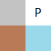

# Sokoban editor documentation

This is a small tooling chain to create levels for sokoban. You need the following tools:

* Tiled Map Editor [https://www.mapeditor.org/](https://www.mapeditor.org/)
* Text editor of your choice
* Working application of sokoban game

## Build level in tiled

1. Open `level_template.tmx` with tiled map editor
1. Fill the map with your tiles. Explanation of the tile set:

Top left to bottom right:

1. Wall
1. Player start position
1. Box
1. Box target field

To make your level right, here are some hints:

1. Add a single player start position
1. Place at least as many boxes as target fields - more boxes are ok.
1. Level should be enclosed by walls.
1. Do not change level size.

Save your level as you like.

## Integrate your level into the game

1. Open your `tmx` file with a text editor. 
2. Inside the xml element `<data>` take the list of numbers to a separate, empty file.
3. Replace the numbers with find and replace according the block format definition from `src/sfml/sokoban/sokoban.cpp`: 
* 0 -> E
* 1 -> W
* 2 -> S
* 3 -> B
* 4 -> T
4. Add the content to the other levels in `src/sfml/sokoban/sokoban.cpp` to the array `level_data`
5. Increase variable `LEVEL_COUNT` by one in `src/sfml/sokoban/sokoban.cpp`.